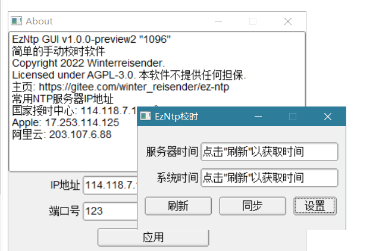

## EzNtp

十分简单的Windows手动校时软件，使用C++,socket,Win32 API,NTP协议和FLTK编写。



编译环境: Mingw GCC 11.2.0 Windows 10 x64

## 命令行版

    g++ ./main_cli.cpp -o main.exe -lwsock32

## FLTK版

#### 使用mingw32-make

将编译好的fltk放到`./packages/fltk/`文件夹中

执行:

```bash
mingw32-make
```

#### 手动编译

以FLTK库的位置在`/c/some/fltk`为例:

    g++ -I/c/some/fltk/include -I/c/some/fltk/include/FL/images -mwindows -DWIN32 -DUSE_OPENGL32 -D_LARGEFILE_SOURCE -D_LARGEFILE64_SOURCE -D_FILE_OFFSET_BITS=64 -o 'main' './main_gui.cpp' -mwindows /c/some/fltk/lib/libfltk.a -ldl -lole32 -luuid -lcomctl32 -lwsock32

## 版权与许可

Copyright 2022 Winterreisender.

Licensed under GNU Affero General Public License Version 3 (AGPL-3.0-only)

This program is free software: you can redistribute it and/or modify it under the terms of the GNU Affero General Public License as published by the Free Software Foundation, only version 3 of the License.

This program is distributed in the hope that it will be useful, but WITHOUT ANY WARRANTY; without even the implied warranty of MERCHANTABILITY or FITNESS FOR A PARTICULAR PURPOSE. See the GNU Affero General Public License for more details.

You should have received a copy of the GNU Affero General Public License along with this program. If not, see <https://www.gnu.org/licenses/>.


## 引用

本程序使用了以下开源软件:

|软件|许可|
|---|---|
| FLTK | [LGPL-2.0 with exceptions that allow for static linking](https://www.fltk.org/COPYING.php) |

