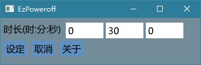

# EzPoweroff



# How to Build

- On Windows with Visual Studio's IDE

Use the provided project file (.vcxproj). Add to solution (imgui_examples.sln) if necessary.

- On Windows with Visual Studio's CLI

```
set SDL2_DIR=path_to_your_sdl2_folder
cl /Zi /MD /I.. /I..\.. /I%SDL2_DIR%\include main.cpp ..\..\backends\imgui_impl_sdl.cpp ..\..\backends\imgui_impl_opengl3.cpp ..\..\imgui*.cpp /FeDebug/example_sdl_opengl3.exe /FoDebug/ /link /libpath:%SDL2_DIR%\lib\x86 SDL2.lib SDL2main.lib opengl32.lib /subsystem:console
#          ^^ include paths                  ^^ source files                                                                                   ^^ output exe                    ^^ output dir   ^^ libraries
# or for 64-bit:
cl /Zi /MD /I.. /I..\.. /I%SDL2_DIR%\include main.cpp ..\..\backends\imgui_impl_sdl.cpp ..\..\backends\imgui_impl_opengl3.cpp ..\..\imgui*.cpp /FeDebug/example_sdl_opengl3.exe /FoDebug/ /link /libpath:%SDL2_DIR%\lib\x64 SDL2.lib SDL2main.lib opengl32.lib /subsystem:console
```

- On Linux and similar Unixes

```
c++ `sdl2-config --cflags` -I .. -I ../.. -I ../../backends main.cpp ../../backends/imgui_impl_sdl.cpp ../../backends/imgui_impl_opengl3.cpp ../../imgui*.cpp `sdl2-config --libs` -lGL -ldl
```

- On Mac OS X

```
brew install sdl2
c++ `sdl2-config --cflags` -I .. -I ../.. -I ../../backends main.cpp ../../backends/imgui_impl_sdl.cpp ../../backends/imgui_impl_opengl3.cpp ../../imgui*.cpp `sdl2-config --libs` -framework OpenGl -framework CoreFoundation
```

## 引用

本项目使用了以下开源软件:

| 项目                                        | 许可  |
| ----------------------------------------- | --- |
| [Dear ImGui](https://github.com/ocornut/imgui) | [MIT license](https://mit-license.org/) |
| [SDL](https://www.libsdl.org/) | [zlib license](https://www.libsdl.org/license.php) |

## 版权与许可

Copyright 2022 Winterreisender.

Licensed under GNU Affero General Public License Version 3 (AGPL-3.0-only)

This program is free software: you can redistribute it and/or modify it under the terms of the GNU Affero General Public License as published by the Free Software Foundation, only version 3 of the License.

This program is distributed in the hope that it will be useful, but WITHOUT ANY WARRANTY; without even the implied warranty of MERCHANTABILITY or FITNESS FOR A PARTICULAR PURPOSE. See the GNU Affero General Public License for more details.

You should have received a copy of the GNU Affero General Public License along with this program. If not, see <https://www.gnu.org/licenses/>.


